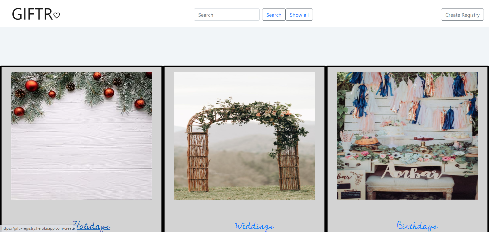
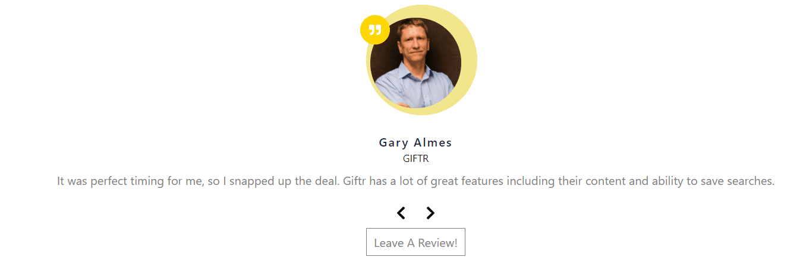
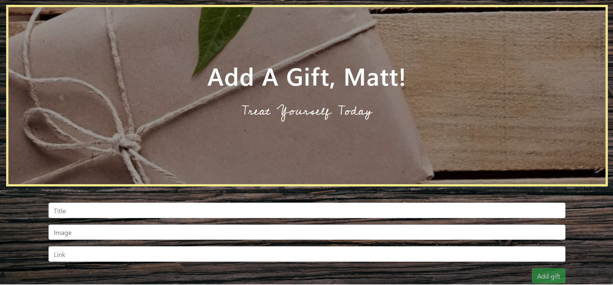

# Giftr
 

## Info: 
Create gift registries for special occasions, look at other users created registries

## Table of Contents 
 [Hosted](#Hosted Application) || [Usage](#Usage) || [License](#License) || [Contributing](#Contributing) || [Tests](#Tests) || [Questions](#Questions)

### Hosted Application:
https://giftr-registry.herokuapp.com/

### Usage:
On loading the home page, choose to create a new registry, show all registries, or search by a registry name. Below that are user reviews, and the opportunity to add your own review of the site.

Once on a registry page, either through creating, picking, or searching for one, the user can add gifts to the list. These gifts have names, thumbnails, and a link to follow that will bring the user to a page where they can purchase said gift.

#### Home:

#### Reviews:

#### Create:

#### Add Gifts:

### License:
 This project is licensed under the MIT license.

### Contributing:

### Tests:
Testing at this stage is as simple as trying to break the application

### Questions:
To contact the authors of this repository, reach them via: 

Github: https://github.com/taylorhackbart
Email: taylor.hackbart@gmail.com

Github: https://github.com/jessicaano92
Email: j.anocibar92@gmail.com

Github: https://github.com/bishank10
Email: chandbishank@gmail.com

Github: https://github.com/mcgeevee
Email: mcgeevee@me.com

Github: https://github.com/matt-boggs
Email: matt.david.boggs@gmail.com